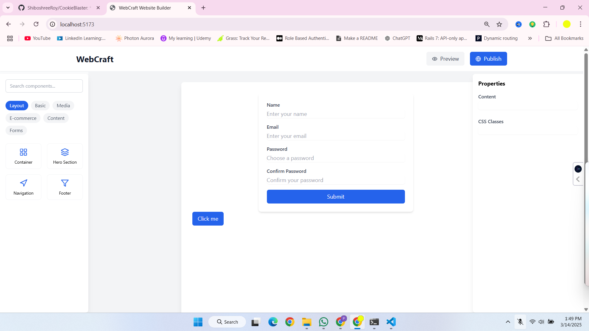

# WebCraft Website Builder



WebCraft is a powerful, drag-and-drop website builder that allows you to create professional websites with ease. Built with React and TypeScript, it features a comprehensive set of components and tools for building modern web applications.

## Features

- **Drag-and-Drop Interface**: Intuitive drag-and-drop functionality for easy website building
- **Component Library**: Rich set of pre-built components including:
  - E-commerce components (Product Grid, Cart, Checkout)
  - Forms (Login, Signup, Contact)
  - Layout components (Navigation, Footer, Hero sections)
  - Content components (Blog posts, FAQs, Testimonials)
- **Real-time Preview**: Live preview of your website as you build
- **Responsive Design**: All components are mobile-friendly and responsive
- **E-commerce Integration**: Full e-commerce functionality with shopping cart and checkout
- **Custom Styling**: Easy customization with Tailwind CSS

## Getting Started

1. Clone the repository
2. Install dependencies:
   ```bash
   npm install
   ```
3. Start the development server:
   ```bash
   npm run dev
   ```

## Usage

1. **Adding Components**:
   - Select components from the left toolbar
   - Drag and drop them onto the canvas
   - Customize properties using the right panel

2. **E-commerce Features**:
   - Add products using the Product Grid component
   - Enable shopping cart functionality
   - Set up payment processing with Stripe

3. **Preview and Publish**:
   - Click the "Preview" button to see your site in a new tab
   - Use "Publish" to deploy your website

## Component Types

### Basic Elements
- Headings
- Paragraphs
- Images
- Buttons

### E-commerce
- Product Grid
- Shopping Cart
- Checkout Form
- Payment Integration

### Forms
- Login Form
- Signup Form
- Contact Form
- Newsletter Signup

### Layout
- Navigation Bar
- Footer
- Hero Sections
- Containers

### Media
- Image Gallery
- Video Player
- Audio Player

## Contributing

Contributions are welcome! Please feel free to submit a Pull Request.

## License

This project is licensed under the MIT License - see the [LICENSE](LICENSE) file for details.

## Demo
[Live Demo](https://webcraftwebsitebuilder.netlify.app/)